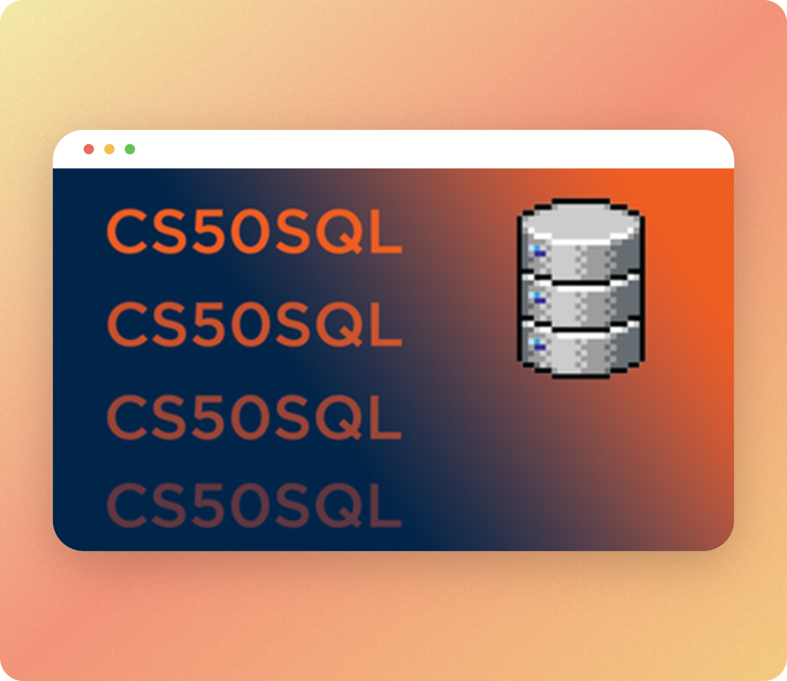
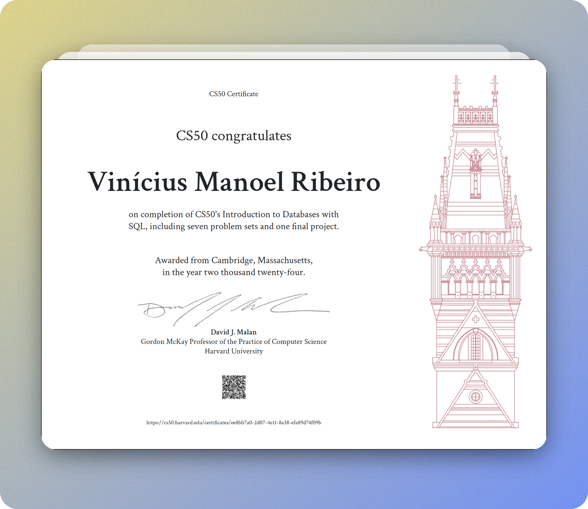

# Harvard CS50SQL 2024 Solutions 

This is CS50’s introduction to databases using a language called SQL. Learn how to create, read, update, and delete data with relational databases, which store data in rows and columns. Learn how to model real-world entities and relationships among them using tables with appropriate types, triggers, and constraints. Learn how to normalize data to eliminate redundancies and reduce potential for errors. Learn how to join tables together using primary and foreign keys. Learn how to automate searches with views and expedite searches with indexes. Learn how to connect SQL with other languages like Python and Java. Course begins with SQLite for portability’s sake and ends with introductions to PostgreSQL and MySQL for scalability’s sake as well. Assignments inspired by real-world datasets.

## Screenshots 🖼️

## Week 0 - Querying 🪜

Tables. Databases. Database Management Systems. SQL. SQLite. SELECT. LIMIT. OFFSET. WHERE. Comparisons. NOT. NULL. Pattern Matching. LIKE. Compound Conditions. Range Conditions. Ordering. Aggregate Functions. ROUND. DISTINCT.

- [Cyberchase](./week_0/cyberchase/)
- [Normals](./week_0/normals/)
- [Players](./week_0/players/)

## Week 1 - Relating 🗣️

Relational Databases. Relationships: One-to-one, One-to-many, Many-to-many. Entity Relationship Diagrams. Keys: Primary Keys, Foreign Keys. Subqueries. IN. Joins: INNER JOIN, Outer Joins, LEFT JOIN, RIGHT JOIN, FULL JOIN, NATURAL JOIN. Sets: INTERSECT, UNION, EXCEPT. Groups: GROUP BY, HAVING.

- [Dese](./week_1/dese/)
- [Moneyball](./week_1/moneyball/)
- [Packages](./week_1/packages/)

## Week 2 - Designing 🖌️

Schemas. Normalizing. Data Types. Storage Classes. Type Affinities. Table Constraints: PRIMARY KEY, FOREIGN KEY. Column Constraints: CHECK, DEFAULT, NOT NULL, UNIQUE. Altering Tables: DROP TABLE, ALTER TABLE, ADD COLUMN, RENAME COLUMN, DROP COLUMN. Charlie.

- [ATL](./week_2/atl/)
- [Connect](./week_2/connect/)
- [Donuts](./week_2/donuts/)

## Week 3 - Writing ✍🏻

Create, Read, Update, Delete. INSERT INTO. CSVs. .import. DELETE FROM. Foreign Key Constraints. UPDATE. Triggers. Soft Deletions.

- [Don't Panic](./week_3/dont-panic/)
- [Meteorites](./week_3/meteorites/)

## Week 4 - Viewing 👀

Views. CREATE VIEW. Views for Simplifying. Views for Aggregating. Temporary Views. CREATE TEMPORARY VIEW. Common Table Expressions. Views for Partitioning. Views for Securing. Soft Deletions.

- [BNB](./week_4/bnb/)
- [Census](./week_4/census/)
- [Private](./week_4/private/)

## Week 5 - Optimizing 🧮

Indexes. CREATE INDEX. EXPLAIN QUERY PLAN. Covering Indexes. B-Trees. Partial Indexes. VACUUM. Concurrency. Transactions. ACID: Atomicity, Consistency, Isolation, Durability. BEGIN TRANSACTION. COMMIT. ROLLBACK. Race Conditions. Locks.

- [Harvard](./week_5/harvard/)
- [Snap](./week_5/snap/)

## Week 6 - Scaling ⛰️

Scalability. MySQL: Integers, Strings, Dates, Times, Real Numbers, Floating-Point Imprecision, Fixed Precision, Altering Tables. Stored Procedures. PostgreSQL. Vertical Scaling. Horizontal Scaling. Replication. Read Replicas. Sharding. Access Controls: GRANT, REVOKE. SQL Injection Attacks. Prepared Statements.

- [Deep](./week_6/deep/)
- [Don't Panic Python](./week_6/dont-panic-python/)
- [Sentimental Connect](./week_6/attention/)

## CS50 Certificate 📑

## License 📝

A short and simple permissive license with conditions only requiring preservation of copyright and license notices. Licensed works, modifications, and larger works may be distributed under different terms and without source code.

